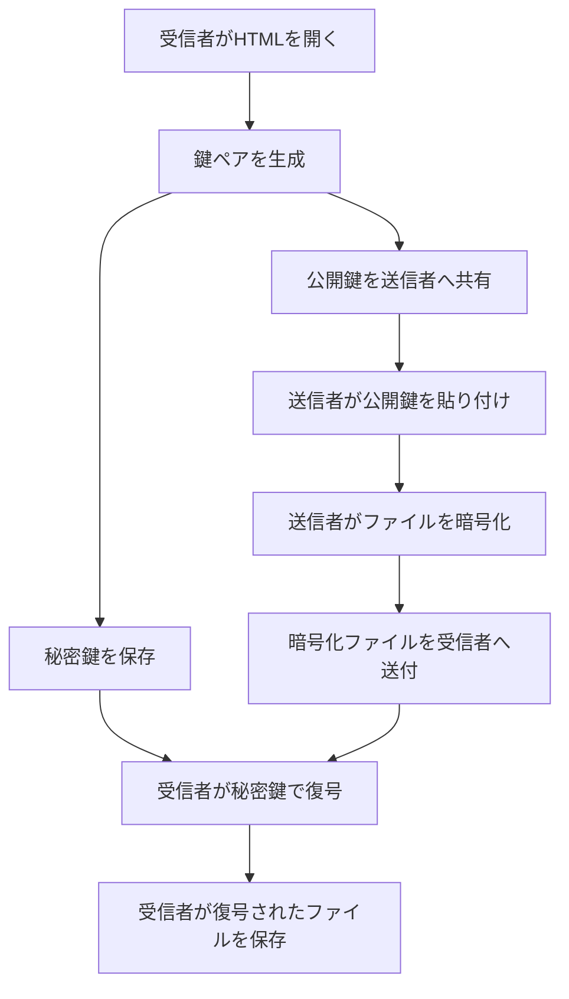

# Secure File Box

オフラインのブラウザだけで使える、クライアントサイド完結のファイル暗号化ツールです。
友人同士や取引先と簡単かつ安全にファイルをやり取りするために作りました。
インストール不要で、1つのページの中で次の操作を行えます。

- 鍵ペア生成
- 公開鍵の共有
- ファイル暗号化
- ファイル復号

> [!IMPORTANT]
> ブラウザ標準の Web Crypto API を使った **独自フォーマット** です。
> 同じツール同士で暗号化・復号して使ってください。

## なぜこれを使うのか

このツールは、次のような用途を想定しています。

- ファイルを暗号化して渡したい
- でもコマンドラインを使いたくない
- でもアプリのインストールもしたくない(させたくない)
- Windows / macOS / Linux / スマホで同じ操作感にしたい
- 復号を受信者の端末内だけで完結させたい

その分、かなり割り切っています。

- **1ファイル配布**: `html` ファイルだけ配ればよい
- **クライアントサイド完結**: ファイル処理はブラウザ内で行う(ブラウザなので大抵の端末で動く)
- **オフラインで使える**: 暗号化と復号するのにアップロード不要
- **レスポンシブ対応**: スマホでも使いやすいUI
- **鍵の分離**: 公開鍵は共有、秘密鍵は受信者だけが保持

**手軽さを優先した単体ツール**として使う前提です。詳細は後述します。

## 画面構成

このツールには3つのタブがあります。

### 1. 鍵管理

- 新しい鍵ペアを生成
- 公開鍵をコピー / 保存
- 秘密鍵をコピー / 保存
- 秘密鍵をこの端末に保存
- 保存済み秘密鍵の読み込み / 削除

### 2. 暗号化

- 相手の公開鍵を入力
- 暗号化したいファイルを選択
- 暗号化済みファイルを保存

### 3. 復号

- 暗号化ファイルを選択
- 秘密鍵を読み込みまたは貼り付け
- 元ファイルとして保存

## 使い方

### 受信者側: 最初にやること

1. `html` をブラウザで開く
2. `1. 鍵管理` タブで **鍵ペアを生成** を押す
3. **秘密鍵をファイル保存** して安全な場所に保管する
4. **公開鍵をコピー** して送信者へ送る
5. 公開鍵は、必要なら電話など別ルートでも相互確認する(なりすまし防止)

### 送信者側: ファイルを暗号化する

1. `html` をブラウザで開く
2. `2. 暗号化` タブを開く
3. 受信者から受け取った **公開鍵** を貼り付ける
4. 暗号化して送信したいファイルを選ぶ
5. **暗号化して保存** を押す
6. できた暗号化ファイルを相手へ送る

### 受信者側: 受け取ったファイルを復号する

1. `html` をブラウザで開く
2. `3. 復号` タブを開く
3. 暗号化ファイルを選ぶ
4. 自分の **秘密鍵** を貼り付けるか、あらかじめ読み込んでおく
5. **復号して保存** を押す
6. 復号された元ファイルを保存する

## 動作の流れ

## 公開鍵確認の考え方

公開鍵そのものを相互確認の対象にする前提です。

たとえば次のように使います。

- メールやチャットツールなどの普段使っている経路で受信者の公開鍵を送受信
- 電話など別経路で、公開鍵の先頭や末尾、必要なら全文を読み合わせて公開鍵と受信者の確認

例:

- 先頭: `PUB-...` の最初の数十文字
- 末尾: 最後の数十文字

公開鍵の取り違えを避けたいときは、**全文確認が最も確実**です。
同じ経路で送ってしまうと、なりすましされる恐れがあります。

## テーマ切り替え

右上のボタンで `Light mode / Dark mode` を切り替えられます。
選択したテーマはブラウザに保存され、次回も同じ状態で開きます。

## 想定環境

- Chrome
- Edge
- Safari
- Firefox
- iPhone / Android の比較的新しいブラウザ

このツールは Web Crypto API を使います。Web Crypto API はブラウザで暗号処理を行うための標準APIです。

## セキュリティ上の注意

- **秘密鍵は絶対に相手へ渡さない**
- 共有端末では **この端末に秘密鍵を保存** を使わない
- まず秘密鍵をファイル保存してバックアップを持つ
- 公開鍵はできるだけ別ルートでも確認する
- このツールは便利さ重視の単一HTMLツールであり、監査済み製品ではない
- 高度な法務・医療・大規模顧客情報などでは、導入前に別途検討する

## 技術メモ

このツールはブラウザの Web Crypto API を用いて、クライアントサイドで暗号化と復号を行います。
Web Crypto API は暗号プリミティブを提供しますが、MDN でも低レベルAPIであり使い方には注意が必要とされています。

## このツールの位置づけ

このツールは、実際のファイル受け渡しでよくある次の問題を埋めるためのものです。

- PPAP は時代遅れで、運用上も安全上も問題が多い
- PGP / S/MIME は仕組みとしては強力だが、相手に設定や理解を求めすぎる
- 共有リンク型のサービスは、リンク漏えい時のリスクや、アカウント・契約・組織設定の制約がある
- 専用のセキュア送信サービスやアプリは便利だが、導入コストや説明コストが高い

このツールは、そうした中間の現実的な選択肢として作られています。

特徴は次の通りです。

- **インストール不要**
- **コマンドライン不要**
- **アカウント不要**
- **サーバー不要**
- **1ファイルのHTMLだけで完結**
- **公開鍵暗号方式でファイルを暗号化**
- **今後も同じ相手と同じ流れで継続利用しやすい**

相手には次のように案内できます。

> このHTMLを開いて鍵を1回作成し、公開鍵を送ってください。
> 以後はこちらでその公開鍵向けに暗号化してファイルを送ります。

## 他の方式との比較

### PPAP(パスワード付きZIP + 別送パスワード)との比較

PPAP では、暗号化されたZIPファイルとは別に、同じ相手へパスワードを送る必要があります。
この方式は、パスワード共有そのものが運用上の弱点になりやすく、誤送信や漏えいにも弱くなります。

このツールでは、**共通パスワードを事前共有する必要がありません**。

優位性:

- 共通パスワード不要
- パスワード別送不要
- 人が考えた弱いパスワードに依存しない
- 受信者の公開鍵で暗号化するため、復号できるのは秘密鍵を持つ相手だけ

### PGP / GPG / S/MIME との比較

PGP、GPG、S/MIME は強力ですが、多くの相手にとっては導入ハードルが高めです。

たとえば次のような負担があります。

- メールクライアント設定
- 鍵管理や証明書管理
- プラグインやソフトの導入
- 仕組みの理解
- 場合によってはコマンドライン操作

このツールは、**仕組みを簡略化し、ブラウザだけで使える**ことを重視しています。

優位性:

- メール設定不要
- 証明書設定不要
- ソフトのインストール不要
- コマンドライン不要
- 非技術者にも説明しやすい

### 共有リンク型サービスとの比較

代表例:

- Dropbox
- OneDrive
- SharePoint
- Box
- Google Drive の共有リンク
- Proton Drive の共有リンク

これらは便利ですが、多くの場合は**リンクにアクセスできること自体**が受け取り条件になります。
そのため、リンクが漏れた場合のリスクがあります。
また、組織設定、外部共有制限、アカウント、権限設定などに左右されることもあります。

このツールは、**リンクの所持ではなく、受信者の秘密鍵の所持を前提に復号する方式**です。

優位性:

- 共有リンクの所持だけでは復号できない
- 通常の送信手段でファイルを送っても、中身は暗号化されたまま
- クラウドストレージや外部共有設定に依存しない
- アカウント権限や共有ポリシーに左右されない

### セキュア送信サービスとの比較

代表例:

- Bitwarden Send
- Tresorit Send
- Wormhole
- Magic Wormhole

これらは安全なファイル送信手段として有用ですが、基本的には**サービスや特定の送信フローに依存**します。
また、単発送信には向いていても、継続的な鍵運用や「今後も同じ相手と同じ方法で送る」運用には必ずしも最適とは限りません。

このツールは、**相手が1回鍵を作れば、その後は同じ公開鍵を使って継続運用しやすい**のが特徴です。

優位性:

- 外部サービス依存がない
- サービス終了や仕様変更の影響を受けにくい
- 完全オフラインで使える
- 同じ相手と継続的に使いやすい
- 単一HTMLを共有するだけで導入できる

### age のようなモダンな暗号ツールとの比較

代表例:

- age
- rage
- 各種 age フロントエンドツール

age 系は非常に筋の良いモダンな暗号ツールですが、通常は導入やコマンドライン操作が必要です。
会社環境によっては、ソフトのインストールやCLI利用が禁止・制限されていることもあります。

このツールは、**age 系の思想に近い「公開鍵暗号によるファイル共有」を、インストール不要・CLI不要で実現すること**を狙っています。

優位性:

- インストール不要
- CLI不要
- ブラウザだけで使える
- 相手に配りやすい
- 導入説明が非常に簡単

### このツールが向いているケース

このツールは次のような場面に向いています。

- PPAP の代替が必要
- 相手にソフトを入れさせたくない
- コマンドラインは使わせたくない
- アカウント登録を求めたくない
- 単発ではなく、同じ相手と今後も同じ流れで使いたい
- なるべく簡単に、しかしパスワードZIPよりは筋の良いやり方にしたい

### このツールの強み

このツールの強みは、暗号理論の新しさそのものよりも、**現場で本当に回せる形に落としていること**です。

つまり、

- 強すぎるが使われない仕組み
- 理想的だが相手が対応できない仕組み

ではなく、

- 実際に相手へ渡しやすい
- 導入説明が短い
- 継続利用しやすい
- パスワード共有型より安全性の筋が良い

というバランスを重視しています。

### まとめ

このツールは、次のような人に向いています。

- PPAP に代わる現実的な手段がほしい
- PGP や S/MIME ほど重い仕組みは避けたい
- Dropbox や共有リンクだけに頼りたくない
- Bitwarden Send や Wormhole よりも継続利用しやすい方式がほしい
- 相手に「これを開いて公開鍵を送ってください」と言えるシンプルさがほしい

**「インストール不要・アカウント不要・CLI不要で使える公開鍵暗号ファイル共有」**
それがこのツールの立ち位置です。

## ロードマップ

- 署名検証機能追加
- 公開鍵の保存機能追加

## 免責事項

このソフトウェアは **現状有姿("as is")** で提供され、明示または黙示を問わず、正確性、安全性、商品性、特定目的への適合性、非侵害性を含むいかなる保証も行いません。

このソフトウェアの利用は、**利用者自身の責任において行うもの**とします。作者は、その正確性、信頼性、可用性、互換性、または安全性について一切保証しません。

このソフトウェアの利用または利用不能により生じたいかなる損害、情報漏えい、データ消失、破損、暗号化または復号の失敗、誤動作、第三者との紛争、その他直接的または間接的な不利益についても、作者は一切の責任を負いません。

利用者は、自らの判断と責任において本ソフトウェアの適合性を確認し、その利用結果について全責任を負うものとします。

## License

This project is licensed under the MIT License. See the [LICENSE](LICENSE) file for details.
